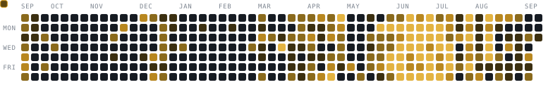

<!--
  Profile README for github.com/krishhna24
  Accent colour is #d29922 (GitHub dark's amber) — it was chosen to sit with the
  warm palette of assets/JohanLiebert.gif. If you swap the GIF, re-pick the accent.
  Generated pieces (do not hand-edit):
    assets/art/*      -> scripts/generate-art.mjs
    assets/snake-*.svg-> scripts/generate-snake.mjs
    the STATS block   -> scripts/update-stats.mjs
  All three run daily from .github/workflows/refresh.yml.
-->

<table>
<tr>
<td width="62%" valign="top">


I build the parts of a system that are hard to get right twice — matching
engines that own their state, queues that survive a restart, and money math
that never touches a float.

When I'm not building my own, I send patches upstream to Kubernetes.

</td>
<td width="38%" valign="top">


<sub><i>calm is a property of systems that recover</i></sub>

</td>
</tr>
</table>

```console
$ whoami --verbose

  handle      krishhna24
  builds      matching engines · queues · recovery · agentic CLI tools
  upstream    kubernetes/kubernetes · kubeedge · excalidraw
  languages   TypeScript (mine) · Go (upstream) · C++ (close to the metal)
  learning    Rust
  rule        no floats in money math, ever
```


<!-- Hand-edited — update this when your focus moves. Nothing here is generated. -->

- Graduating declarative validation rules beta → stable in Kubernetes
  ([tracking issue](https://github.com/kubernetes/kubernetes/issues/141532) ·
  [first PR](https://github.com/kubernetes/kubernetes/pull/141533))
- Hardening **perps** — integration coverage and retry/DLQ handling on the event queue
- Enabling the remaining `kube-api-linter` rules across the `batch` and `authorization` groups
- Extending **glyph-agent**'s tool loop


<table>
<tr>
<td width="50%" valign="top">

### [perps](https://github.com/krishhna24/perps)

A perpetual-futures exchange built from scratch as a distributed system.
An in-memory matching engine owns the book, balances and positions; six
services around it handle persistence, market-data fan-out, the mark-price
oracle, 8-hourly funding settlement, liquidation and the REST API.

`TypeScript` `Bun` `Turborepo` `Redis` `BullMQ` `Postgres` `Prisma` `S3`

</td>
<td width="50%" valign="top">

### [glyph-agent](https://github.com/krishhna24/glyph-agent) · [`npm`](https://www.npmjs.com/package/glyph-agent)

An AI coding agent that lives in your terminal. Streams from any
OpenAI-compatible endpoint, runs an agentic tool-use loop and edits your
codebase from a TUI. Published and installable — `npx glyph-agent`.

`TypeScript` `pnpm` `Turborepo` `Vitest` `MIT`

</td>
</tr>
<tr>
<td width="50%" valign="top">

### [100xNess](https://github.com/krishhna24/100xNess)

A trading backend split into API, engine and price-poller services,
communicating over Redis streams and pub/sub. Built in the open across
twelve PRs, with a written day-by-day engineering log.

`TypeScript` `Redis Streams` `Prisma` `Postgres`

</td>
<td width="50%" valign="top">

### [api-rate-limiting](https://github.com/krishhna24/api-rate-limiting) <sub>· wip</sub>

Configurable IP rate-limiting middleware for Express. Memory or Redis
store, per-route policies, burst allowance and proxy-trust. Redis get-set
is Lua-scripted so concurrent requests can't race the counter.

`TypeScript` `Bun` `Express` `Redis` `Lua`

</td>
</tr>
</table>

<sub>Also: <a href="https://github.com/krishhna24/stock-view">stock-view</a> (Next.js market dashboard) ·
<a href="https://github.com/krishhna24/CEX-MatchingEngine-Assignment">CEX matching engine</a> (queue-based RPC) ·
<a href="https://github.com/krishhna24/r2-file-upload-demo">r2-file-upload</a></sub>


<!-- Each icon links to that project's site. To add one: copy a line and swap
     the skillicons id (see https://skillicons.dev), the title/alt and the href. -->
<table>
<tr>
<td valign="middle"><sub><b>LANGUAGES</b></sub></td>
<td valign="middle">
<a href="https://www.typescriptlang.org/" title="TypeScript"></a>
<a href="https://go.dev/" title="Go"></a>
<a href="https://isocpp.org/" title="C++"></a>
<a href="https://www.gnu.org/software/bash/" title="Bash"></a>
</td>
</tr>
<tr>
<td valign="middle"><sub><b>RUNTIMES</b></sub></td>
<td valign="middle">
<a href="https://bun.sh/" title="Bun"></a>
<a href="https://nodejs.org/en" title="Node.js"></a>
<a href="https://pnpm.io/" title="pnpm"></a>
<a href="https://vite.dev/" title="Vite"></a>
</td>
</tr>
<tr>
<td valign="middle"><sub><b>FRAMEWORKS</b></sub></td>
<td valign="middle">
<a href="https://expressjs.com/" title="Express"></a>
<a href="https://nextjs.org/" title="Next.js"></a>
<a href="https://react.dev/" title="React"></a>
<a href="https://www.prisma.io/" title="Prisma"></a>
</td>
</tr>
<tr>
<td valign="middle"><sub><b>DATABASES &amp; MESSAGING</b></sub></td>
<td valign="middle">
<a href="https://www.postgresql.org/" title="PostgreSQL"></a>
<a href="https://www.mongodb.com/" title="MongoDB"></a>
<a href="https://redis.io/" title="Redis"></a>
<a href="https://kafka.apache.org/" title="Apache Kafka"></a>
<a href="https://www.rabbitmq.com/" title="RabbitMQ"></a>
</td>
</tr>
<tr>
<td valign="middle"><sub><b>INFRA</b></sub></td>
<td valign="middle">
<a href="https://www.docker.com/" title="Docker"></a>
<a href="https://kubernetes.io/" title="Kubernetes"></a>
<a href="https://aws.amazon.com/" title="AWS"></a>
<a href="https://git-scm.com/" title="Git"></a>
<a href="https://www.kernel.org/" title="Linux"></a>
<a href="https://github.com/features/actions" title="GitHub Actions"></a>
</td>
</tr>
<tr>
<td valign="middle"><sub><b>LEARNING</b></sub></td>
<td valign="middle">
<a href="https://www.rust-lang.org/" title="Rust"></a>
</td>
</tr>
</table>


Most of it is API machinery: migrating validation to declarative markers,
turning on `kube-api-linter` rules group by group, moving controllers to
`AddEventHandlerWithOptions`, and tracking down flaky tests to their cause.

<!-- Regenerated daily by scripts/update-stats.mjs — edit the script, not this block. -->
<!-- STATS:START -->
```text
REPOSITORY                STARS   MERGED  AREAS
kubernetes/kubernetes     125k    13      api-machinery · storage · auth · cli
kubeedge/kubeedge         7.6k    1       edge runtime · image refs
excalidraw/excalidraw     130k    2       editor · svg export

last 12 months   982 contributions   343 commits   49 pull requests
```
<!-- STATS:END -->

<sub>
<a href="https://github.com/kubernetes/kubernetes/pull/140062">storage: migrate CSIDriver volumeLifecycleModes to declarative validation</a> ·
<a href="https://github.com/kubernetes/kubernetes/pull/139890">ipallocator: replace sets.String with sets.Set</a> ·
<a href="https://github.com/kubernetes/kubernetes/pull/139943">volume: use AddEventHandlerWithOptions in protection controllers</a> ·
<a href="https://github.com/kubeedge/kubeedge/pull/6997">imageparser: keep both tag and digest when parsing a reference</a> ·
<a href="https://github.com/excalidraw/excalidraw/pull/11441">excalidraw: fix invisible labelled arrows in exported SVG</a> ·
<a href="https://github.com/krishhna24?tab=overview">all activity →</a>
</sub>


<!-- Generated by scripts/generate-snake.mjs and committed to assets/.
     Nothing external renders this, so it cannot 404 or rate-limit.
     Refresh: GITHUB_TOKEN=... node scripts/generate-snake.mjs -->
<picture>
  <source media="(prefers-color-scheme: light)" srcset="./assets/snake-light.svg" />
  
</picture>


> At work, I don't need to be the loudest person in the room. I observe,
> understand, and move with purpose. While others chase recognition, I focus
> on becoming impossible to ignore through results.

**Name what isn't done.** Every project I ship carries a *Known limitations*
section. An unmarked gap is a defect; a documented one is a roadmap.

**Exactness over convenience.** A float in a balance is a bug nobody has
noticed yet.

**Cleanup counts.** Most of my upstream work is linting, test coverage and
flake triage — unglamorous, and the reason the interesting changes land safely.


<a href="https://github.com/krishhna24"></a>
<a href="https://www.linkedin.com/in/krishhna-tupe-974593305/"></a>
<a href="https://x.com/krishhna_dev"></a>
<a href="mailto:krishhnatupedev@gmail.com"></a>

<br>

<sub></sub>
